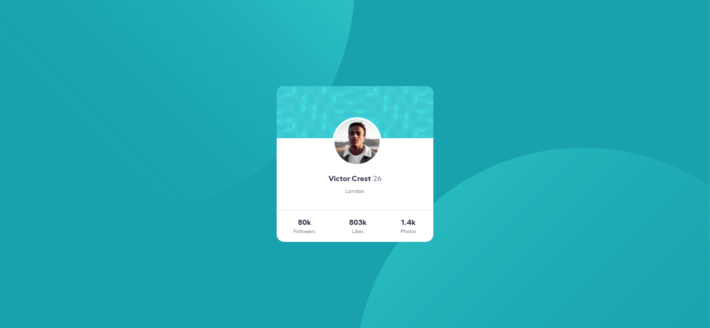
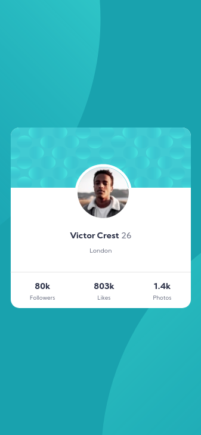

# Frontend Mentor - Profile card component solution

This is a solution to the [Profile card component challenge on Frontend Mentor](https://www.frontendmentor.io/challenges/profile-card-component-cfArpWshJ). Frontend Mentor challenges help you improve your coding skills by building realistic projects. 

## Table of contents

- [Frontend Mentor - Profile card component solution](#frontend-mentor---profile-card-component-solution)
  - [Table of contents](#table-of-contents)
  - [Overview](#overview)
    - [The challenge](#the-challenge)
    - [Screenshot](#screenshot)
      - [Desktop view](#desktop-view)
      - [Mobile view](#mobile-view)
    - [Links](#links)
  - [My process](#my-process)
    - [Built with](#built-with)

## Overview

### The challenge

- Build out the project to the designs provided

### Screenshot

#### Desktop view

#### Mobile view

### Links

- Solution URL: (https://github.com/hemantsirsat/challenge-3)
- Live Site URL: (https://challenge-3-eta.vercel.app/)

## My process

### Built with

- [Next.js](https://nextjs.org/) - React framework
